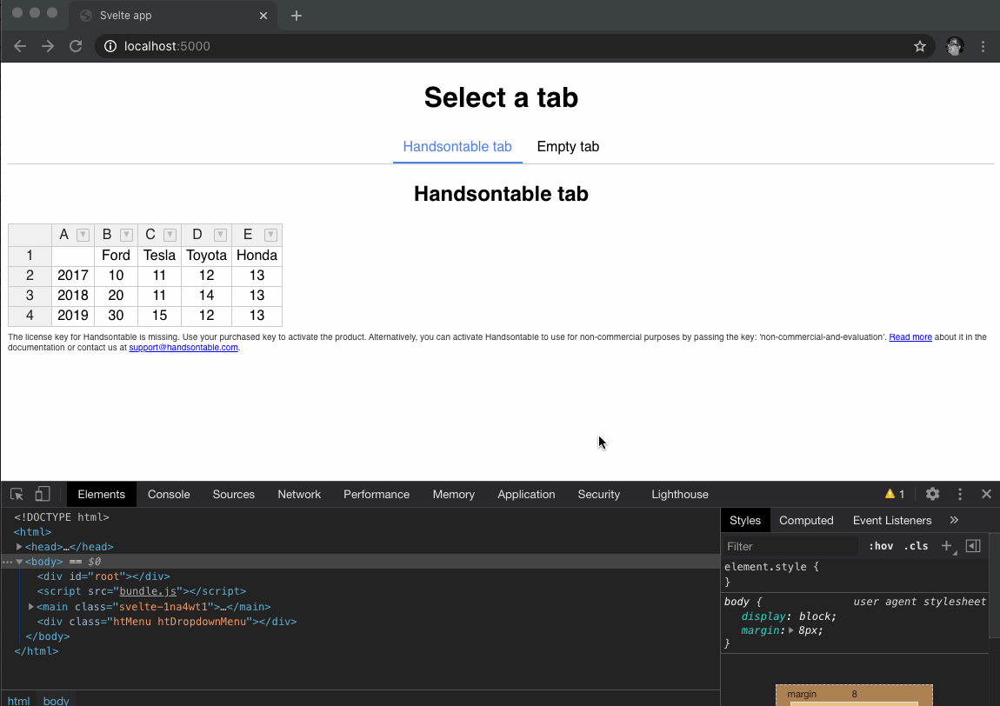

# svelte-handsontable-task

## Problem

In this project, there are two tabs. The problem is that toggling between tabs leaves some artifacts in DOM.

### Steps to reproduce

1. Start the project
2. For several times, switch between "Handsontable tab" and "Empty tab"
3. Notice that after each time you switch away from the "Handsontable tab", some artifacts remain in DOM:
   - `
`
   - `

`

## Task

Your task is to fix the app so that there will be no remaining artifacts in DOM when switching between the tabs.

### Hints

1. The problem is that the Handsontable instance is not destroyed when switching between the tabs